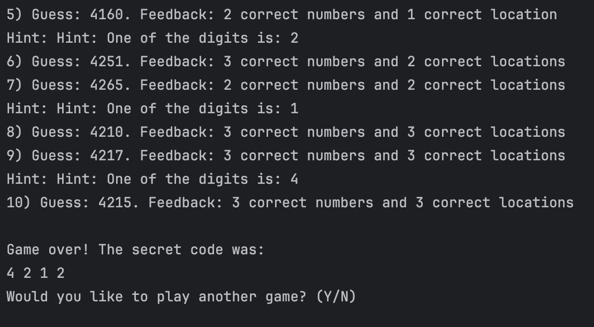

# mastermindGame
### During this project, my objective was to create a game where the user needs to guess the secret 4 or 5 digit code within 10 attempts. The code consists of numbers between 0 and 7 or 0 - 9, and duplicate digits are allowed.

## Table of Contents
- [Requirements](#requirements)
- [Usage](#usage)
- [How it Works](#how-it-works)
- [Features](#features)
- [Future Improvements](#future-improvements)


## Requirements
- [Git](https://git-scm.com/downloads)
- [Java 17](https://www.oracle.com/th/java/technologies/downloads/) or Higher
- [IntelliJ IDEA](https://www.jetbrains.com/idea/download/)
- [Random API](https://api.random.org/api-keys)

## Usage
1. Clone the repo:
``` 
    git clone https://github.com/Saidakramov/mastermindGame.git
```
2. Launch Project in IntelliJ IDEA:
    - Click Open and select the project directory. Please open `MastermindGame` inside the `mastermindGame` folder to run the project successfully.'
3. Generating the secret code:
    - Using Random.org is optional — if no API key is provided, the game defaults to Java’s built-in random generator.
    - Option 1: Obtaining and API Key from Random.org (Optional)
        - Go to [Random.org API Keys page](https://api.random.org/api-keys).
        - Sign up for a free account and generate your API key.
        - Copy the key.
        - In your project, create a file named `config.properties` and add:
          - `api-key=your-key`
          - `api.url=https://api.random.org`
        - Run the program. The Game will fetch truly random numbers from Random.org.
    - Option 2: Local Random Generator(Offline mode)
      - If you don't want to set up an API key, the game will automatically fall back to local random generator. No setup is needed. The numbers will still be generated randomly within the specified range.
      ```
      // Local random numbers fallback
      int[] secretNumbers = RandomOrgSecretNumbers.generateSecretNumbers(numDigits, minDigit, maxDigit);
      ```


4. Run the Application
    - Open `Main.java` file inside `src/main/java/com/linkedin` directory.
    - Right-click on the `Main` class and select `Run Main.main()`
5. Interact with the CLI:
    - Follow the instructions displayed in the terminal.
   
## How it Works
- The game will ask the user to choose a game level on the first screen from the following options
   - Easy level where users need to guess four digits from 0-7.
   - Medium level where users need to guess four digits from 0-9.
   - Hard level where users need to guess five digits from 0-9.
  
   <br>
  
    

- Once the user selects a level, the instructions message will display, informing them of the number of attempts and prompting them to enter their guess according to the rules.
    
    <br>
  
    
    

- After every attempt, the user will receive feedback if they guessed any correct numbers in the right locations or correct numbers in the wrong locations
    
    <br>
  
    

- If the user could not guess the secret code, the program will reveal the code and ask the user if they want to try again. If the user guesses numbers correctly, a Congratulations message will display and ask if the user wants to try again.

    <br>

<p align="center">
  
  
</p>

## Features
- History feature: User can see a history of attempts with the corresponding feedback for a better game experience.
  
    <br>
    
    
    

- Hint feature: Every 5th, 7th, and 9th attempt, the user has an option to use a hint to make the game easier.
  
    <br>
  
    

## Future Improvements
- Leaderboard with player names and scores (MySQL backend).
 - Difficulty customization (choose number of digits or attempts).
 - Multiplayer mode.
